# 📖 Project Inside Out - Mi Diario


## 🎯 Descripción del Proyecto
**Mi Diario** es una aplicación de consola desarrollada en Java que permite a los usuarios gestionar sus momentos vividos y películas vistas, asociándolos con emociones específicas. Inspirada en la película "Inside Out", esta aplicación ayuda a los usuarios a llevar un registro emocional de sus experiencias.


## 📋 Funcionalidades Principales
**🌟 Gestión de Momentos**
- ✅ Crear momentos con título, descripción, fecha y emoción
- ✅ Visualizar todos los momentos registrados
- ✅ Eliminar momentos específicos por ID
- ✅ Filtrar momentos por emoción o fecha
- ✅ Clasificar momentos como buenos o malos
- ✅ Exportar a archivo CSV


**🎬 Gestión de Películas**
- ✅ Registrar películas mediante integración con API de IMDb
- ✅ Asociar emociones a las películas vistas
- ✅ Guardar automáticamente en archivo CSV


**🎭 Emociones Disponibles**

| ID | Emoción | ID | Emoción |
| -- | ------- | -- | ------- |
| 1  | Alegría | 6  | Ansiedad |
| 2  | Tristeza | 7  | Envidia |
| 3  | Ira | 8  | Vergüenza |
| 4  | Asco | 9  | Aburrimiento |
| 5  | Miedo | 10 | Nostalgia |


## 🚀 Instalación y Ejecución
**Instalar dependencias con Maven**
El proyecto utiliza Gson para el manejo de JSON. Asegúrate de que tu pom.xml contenga la siguiente dependencia:
```
<dependency>
    <groupId>com.google.code.gson</groupId>
    <artifactId>gson</artifactId>
    <version>2.13.1</version>
</dependency>
```


## 🌐 APIs Utilizadas

- IMDb API: https://imdb.iamidiotareyoutoo.com/search?tt=
- Método: GET
- Parámetro: ID de IMDb (ejemplo: tt0118583)
- Respuesta: JSON con información completa de la película


## Diagram

```mermaid

classDiagram
    %% ===== MAIN APPLICATION =====
    class App {
        -App()
        +main(String[] args)$ void
    }

    %% ===== ENUMS =====
    class Emotion {
        <<enumeration>>
        ALEGRIA(1)
        TRISTEZA(2)
        IRA(3)
        ASCO(4)
        MIEDO(5)
        ANSIEDAD(6)
        ENVIDIA(7)
        VERGUENZA(8)
        ABURRIMIENTO(9)
        NOSTALGIA(10)
        -int numberEmotion
        +getnumberEmotion() int
    }

    class Mood {
        <<enumeration>>
        BUENO(1)
        MALO(2)
        -int numberMood
        +getnumberMood() int
    }

    %% ===== MODELS =====
    class Moment {
        -int nextId$
        -int id
        -LocalDateTime createdAt
        -LocalDateTime modifiedAt
        -Date date
        -String title
        -String description
        -Emotion emotion
        -Mood mood
        +Moment(int, String, String, Emotion, Date, Mood)
        +getId() int
        +getTitle() String
        +getDescription() String
        +getEmotion() Emotion
        +getDate() Date
        +getCreatedAt() LocalDateTime
        +getModifiedAt() LocalDateTime
        +getMood() Mood
        +setTitle(String) void
        +setDescription(String) void
        +setEmotion(Emotion) void
        +toString() String
    }

    %% ===== DTOs =====
    class MomentDTO {
        <<record>>
        +int id
        +String title
        +String description
        +Emotion emotion
        +Date date
        +Mood mood
    }

    class MomentDTOResponse {
        <<record>>
        +int id
        +String title
        +String description
        +Emotion emotion
        +Date date
        +Mood mood
    }

    %% ===== MAPPERS =====
    class MomentMapper {
        +toEntity(MomentDTO) Moment$
        +toResponse(Moment) MomentDTOResponse$
    }

    %% ===== INTERFACES =====
    class InterfaceDataBase {
        <<interface>>
        +store(Moment) void
        +getAll() List~Moment~
        +deleteById(int) void
    }

    %% ===== DATABASE =====
    class MomentDataBase {
        -List~Moment~ moments
        +MomentDataBase()
        +store(Moment) void
        +getAll() List~Moment~
        +deleteById(int) void
    }

    %% ===== REPOSITORY =====
    class MomentRepository {
        -InterfaceDataBase db
        +MomentRepository()
        +StoreMoment(Moment) void
        +getAllMoments() List~Moment~
        +deleteMoment(int) void
        +findByEmotions(Emotion) List~Moment~
        +getMomentsByDate(int) List~Moment~
        +findByMood(Mood) List~Moment~
    }

    class MomentCSVRepository {
        +exportMomentCSV(List~Moment~, String) void$
    }

    %% ===== CONTROLLERS =====
    class HomeController {
        +HomeController()
        +index() void
    }

    class MomentController {
        -MomentRepository repository
        +MomentController()
        +StoreMoment(MomentDTO) void
        +getAllMoments() void
        +deleteMoment(int) void
        +getMomentByEmotion(Emotion) List~MomentDTOResponse~
        +getMomentsByDate(int) List~MomentDTOResponse~
        +getMomentByMood(Mood) List~MomentDTOResponse~
        +exportAllMoments(String) void
    }

    %% ===== SINGLETONS =====
    class MomentControllerSingleton {
        -MomentController INSTANCE$
        -MomentControllerSingleton()
        +getInstance() MomentController$
    }

    class MomentRepositorySingleton {
        -MomentRepository INSTANCE$
        -MomentRepositorySingleton()
        +getInstance() MomentRepository$
    }

    %% ===== VIEWS =====
    class View {
        #Scanner SCANNER$
    }

    class HomeView {
        -MomentController CONTROLLER$
        +printMenu() void$
        +getSCANNER() Scanner$
    }

    class MomentPostView {
        -MomentController CONTROLLER$
        +printStoreMenu() void$
    }

    class MomentDeleteView {
        -MomentController CONTROLLER$
        +printDeleteMenu() void$
    }

    class MomentFilterView {
        +printFilterMenu() void$
    }

    class MomentFilterEmotionView {
        -MomentController CONTROLLER$
        +filterByEmotion() void$
    }

    class MomentFilterDateView {
        -MomentController CONTROLLER$
        +filterByDate() void$
    }

    class MomentGetView {
        +printAllMoments(List~MomentDTOResponse~) void$
    }

    class MomentExportCSVView {
        -MomentController CONTROLLER$
        +printExportMenu() void$
    }

    %% ===== MOVIE MODULE =====
    class Movie {
        -int imdbId
        -String name
        -String[] genre
        -Emotion emotion
        -String datePublished
        -String creationDate
        +Movie(int, String, String[], Emotion, String, String)
        +toCSVString() String
        +getImdbId() int
        +getName() String
        +getGenre() String[]
        +getEmotion() Emotion
        +getDatePublished() String
        +getCreationDate() String
        %% setters...
    }

    class MovieDTO {
        -String imdbId
        -String response
        -String error
        -ShortInfoVO shortInfo
        +getImdbId() String
        +getShortInfo() ShortInfoVO
        +getResponse() String
        +setResponse(String) void
        +getError() String
        +setError(String) void
    }

    class ShortInfoVO {
        -String name
        -String[] genre
        -String datePublished
        +getName() String
        +getGenre() String[]
        +getDatePublished() String
        +equals(Object) boolean
        +hashCode() int
    }

    class MovieMapper {
        +toEntity(MovieDTO, Emotion) Movie$
    }

    class InterfaceApiMoviesDAO {
        <<interface>>
        +getMovie(String) String
    }

    class ApiMovieDAO {
        -String url
        +ApiMovieDAO()
        +getMovie(String) String
    }

    class MovieService {
        -ApiMovieDAO movieDAO
        -Gson gson
        +MovieService()
        +getMovieInfo(String) JsonObject
        +getMovieInfoAndMapToDTO(String) MovieDTO
        +findMovieByTitle(String) MovieDTO
    }

    class MovieCSVRepository {
        -String CSV_FILE$
        +exportMovieCSV(List~Movie~, String) void$
        +save(Movie) void
    }

    class MovieController {
        -MovieCSVRepository repository
        -MovieService apiService
        +MovieController()
        +addMovie(String, Emotion) void
    }

    class MovieControllerSingleton {
        -MovieController INSTANCE$
        -MovieControllerSingleton()
        +getInstance() MovieController$
    }

    class MovieRepositorySingleton {
        -MovieCSVRepository INSTANCE$
        -MovieRepositorySingleton()
        +getInstance() MovieCSVRepository$
    }

    class MoviePostView {
        -MovieController movieController$
        -Scanner SCANNER$
        +addMovieFromApi() void$
    }

    %% ===== RELATIONSHIPS =====
    
    %% Main relationships
    App --> HomeController : creates
    HomeController --> HomeView : uses
    
    %% Model relationships
    Moment --> Emotion : uses
    Moment --> Mood : uses
    
    %% DTO relationships
    MomentDTO --> Emotion : contains
    MomentDTO --> Mood : contains
    MomentDTOResponse --> Emotion : contains
    MomentDTOResponse --> Mood : contains
    
    %% Mapper relationships
    MomentMapper --> Moment : creates
    MomentMapper --> MomentDTO : uses
    MomentMapper --> MomentDTOResponse : creates
    
    %% Database relationships
    MomentDataBase ..|> InterfaceDataBase : implements
    MomentDataBase --> Moment : stores
    
    %% Repository relationships
    MomentRepository --> InterfaceDataBase : uses
    MomentRepository --> Moment : manages
    
    %% Controller relationships
    MomentController --> MomentRepository : uses
    MomentController --> MomentDTO : receives
    MomentController --> MomentDTOResponse : returns
    MomentController --> MomentMapper : uses
    MomentController --> MomentCSVRepository : uses
    
    %% Singleton relationships
    MomentControllerSingleton --> MomentController : provides
    MomentRepositorySingleton --> MomentRepository : provides
    
    %% View inheritance
    HomeView --|> View : extends
    MomentPostView --|> View : extends
    MomentDeleteView --|> View : extends
    MomentFilterView --|> View : extends
    MomentFilterEmotionView --|> View : extends
    MomentFilterDateView --|> View : extends
    MomentGetView --|> View : extends
    MomentExportCSVView --|> View : extends
    MoviePostView --|> View : extends
    
    %% View dependencies
    HomeView --> MomentControllerSingleton : uses
    MomentPostView --> MomentControllerSingleton : uses
    MomentDeleteView --> MomentControllerSingleton : uses
    MomentFilterEmotionView --> MomentControllerSingleton : uses
    MomentFilterDateView --> MomentControllerSingleton : uses
    MomentExportCSVView --> MomentControllerSingleton : uses
    
    %% Movie module relationships
    Movie --> Emotion : uses
    MovieDTO --> ShortInfoVO : contains
    MovieMapper --> MovieDTO : uses
    MovieMapper --> Movie : creates
    MovieMapper --> Emotion : uses
    
    ApiMovieDAO ..|> InterfaceApiMoviesDAO : implements
    MovieService --> ApiMovieDAO : uses
    MovieService --> MovieDTO : creates
    
    MovieController --> MovieCSVRepository : uses
    MovieController --> MovieService : uses
    MovieController --> MovieMapper : uses
    
    MovieControllerSingleton --> MovieController : provides
    MovieRepositorySingleton --> MovieCSVRepository : provides
    
    MoviePostView --> MovieController : uses
    MoviePostView --> Emotion : uses
    
    %% Cross-module relationships
    HomeView --> MoviePostView : calls
```


## 👥 Autores
**Paula** - Desarrollo principal - @dev.paula
